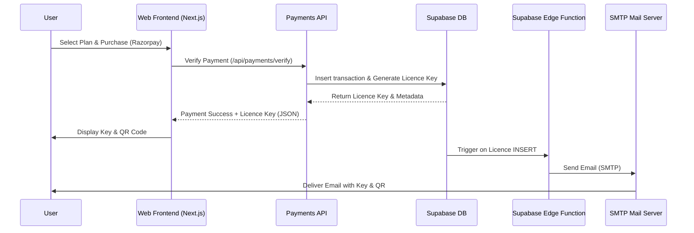
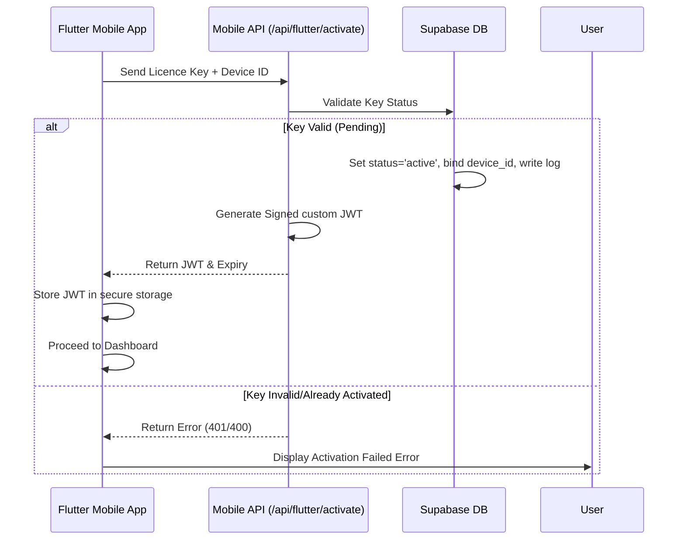

# Licence Key System Design Specification

This document details the architectural and functional design of the new unified licence-key model for the Keeelai platform (Next.js backend/web & Flutter mobile app).

---

## 1. Executive Summary & Context

### Purpose
To transition the Keeelai platform from a traditional account-level subscription to a device-locked, licence-key-based access control system. This unified system supports individual web purchases, bulk enterprise distribution, and administrative free grants, using the same underlying database architecture.

### Target Users
- **Students (Mobile App Users)**: Activate and access learning simulations using a single-use licence key without needing email accounts.
- **Web Purchasers / Parents**: Purchase licence keys via Razorpay on the website and manage keys on their dashboard.
- **Enterprise / School Admins**: Track and view keys issued to their respective organizations.
- **Super Admins**: Generate bulk keys, create organizations, manage metrics, and manually revoke/reissue keys.

---

## 2. Decision Log

| Decision | Alternatives Considered | Reason for Selection |
|---|---|---|
| **Approach A (Unified Licence-Centric)** | **Approach B**: Supabase shadow accounts.<br>**Approach C**: Middleware proxy layer. | Provides a single source of truth for access status, simplifies admin reporting, and avoids polluting Supabase users table with anonymous keys. |
| **Manual Device Gating** | **Device Fingerprinting** (Android ID, Advertising ID, UUID generation). | Avoids privacy issues, platform permissions, and fingerprint instability. Uses a simple server-side activation state toggle. |
| **Custom JWT Auth for Mobile** | **Supabase anonymous login**. | Prevents account creation spam in Supabase while preserving the existing token-based authorization headers in API endpoints. |
| **Short Alphanumeric Key Format** | **UUID v4**, **Numeric PINs**. | `KEEL-XXXX-XXXX` (12 characters, base-32) is highly secure, easily readable, and simple to type on mobile screens. |
| **Admin-Only Licence Transfer** | **Self-Service transfer on dashboard**. | Prevents licence sharing abuse by requiring support interaction, ensuring security for early stages. |

---

## 3. Database Schema Updates

We introduce three new tables to replace the legacy school-specific tables:

```sql
-- 1. Organisations table
CREATE TABLE organisations (
    id UUID PRIMARY KEY DEFAULT gen_random_uuid(),
    name TEXT NOT NULL UNIQUE,
    created_at TIMESTAMPTZ DEFAULT now() NOT NULL
);

-- 2. Licences table
CREATE TYPE licence_source AS ENUM ('mobile', 'web', 'dashboard');
CREATE TYPE licence_type AS ENUM ('free', 'paid');
CREATE TYPE licence_status AS ENUM ('pending', 'active', 'expired', 'revoked');

CREATE TABLE licences (
    id UUID PRIMARY KEY DEFAULT gen_random_uuid(),
    key TEXT NOT NULL UNIQUE, -- KEEL-XXXX-XXXX
    duration_months INTEGER NOT NULL,
    organisation_id UUID REFERENCES organisations(id) ON DELETE SET NULL,
    purchaser_profile_id UUID REFERENCES profiles(id) ON DELETE SET NULL,
    source licence_source NOT NULL,
    type licence_type NOT NULL,
    status licence_status DEFAULT 'pending' NOT NULL,
    activated_at TIMESTAMPTZ,
    expires_at TIMESTAMPTZ,
    last_activated_device_id TEXT,
    created_at TIMESTAMPTZ DEFAULT now() NOT NULL
);

-- 3. Licence Activity Log table (Append-only audit trail)
CREATE TABLE licence_activity_log (
    id UUID PRIMARY KEY DEFAULT gen_random_uuid(),
    licence_id UUID REFERENCES licences(id) ON DELETE CASCADE NOT NULL,
    action TEXT NOT NULL, -- 'created', 'activated', 'transferred', 'expired', 'revoked'
    performed_by UUID REFERENCES profiles(id) ON DELETE SET NULL,
    metadata JSONB DEFAULT '{}'::jsonb NOT NULL,
    created_at TIMESTAMPTZ DEFAULT now() NOT NULL
);
```

---

## 4. Key Workflows & Data Flows

### A. Web Purchase & Key Delivery


### B. Mobile App Activation (Key-Only Auth)


---

## 5. Mobile App (Flutter) Changes

### Secure Storage Keys
- `licence_jwt`: Stores the custom signed JWT used in request headers.
- `licence_key`: Stores the raw licence key `KEEL-XXXX-XXXX`.
- `activated_device_id`: Stores the device ID used for the activation binding.

### Route & Auth Guard Updates
- Eliminate email/password screens (`login_screen.dart`, `register_screen.dart`) from default mobile routing.
- The router checks for the existence of `licence_jwt` in secure storage.
- If present, redirects to `/home`.
- If missing, redirects to `/activate` (a new simple activation screen with a text input field and a QR code scanner button).

---

## 6. Admin & Reporting Dashboard

The Admin Dashboard is extended to include:
- **Bulk Generator**: Input quantity, duration, organisation. Inserts multiple records to DB, downloads CSV.
- **KPI Indicators**:
  - Activated vs. Available licences per Organisation.
  - Active licenses from `web` vs. `dashboard` vs. `mobile`.
- **Reissue Action**: Revokes a key, copies its duration, and issues a new key.

---

## 7. Key Risks & Mitigation

- **Brute Force Key Guessing**: The `/api/flutter/activate` endpoint must be rate-limited by IP and device ID (e.g., max 5 attempts per minute).
- **JWT Expiry & Renewal**: If the custom JWT expires, the app must silently send the stored `licence_key` + `device_id` to `/api/flutter/activate` to renew the JWT without interrupting the user.
- **Offline Access**: Already downloaded content is decrypted on playback. The app checks local secure storage for the key. If the user goes online, the app re-validates the token.
